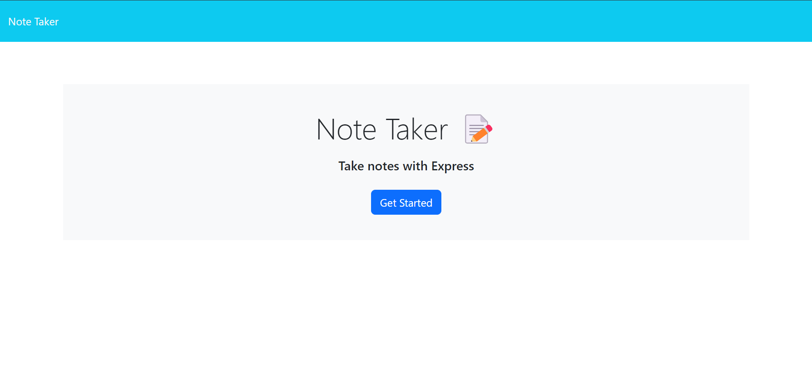

  # Express Note Taker
  

  ## Project Description
  
  The goal of this project was to further my understanding of Express.js and build a backend framework to support the functionality of an already developed front end application. In building the backend the user can now write new notes, view past notes, and delete notes that are no longer needed. I learned how to structure routes, use express,  and set up a server. 
  
  ## Table of Contents

  - [User Story](#user-story)
  - [Deployed Link](#deployed-link)
  - [Installation](#installation)
  - [Usage](#usage)
  - [Application Screenshot](#application-screenshot)
  - [Credits](#credits)
  - [License](#license)
  - [Features](#features)
  - [How to contribute](#how-to-contribute)
  - [Tests](#tests)

  ## User Story

  AS A small business owner,
  I WANT to be able to write and save notes,
  SO THAT I can organize my thoughts and keep track of tasks I need to complete.

  ## Deployed Link

  https://expressnotetaker-isbs.onrender.com

  ## Installation

  This application is used online and requires no installation.

  ## Usage

  It should be used to take notes to remind the user of tasks that need to be completed and how to complete them.

  ## Application Screenshot

  

  ## Credits

  Sean Madigan and edX 

  ## License

  MIT: (https://opensource.org/licenses/MIT)

  This application is covered under the MIT License. Please see the above link for all pertinent information pertaining to use of this code under the associated license.

  ## Features

  You are first presented with a landing page that prompts the user to "Get Started". When clicked the server serves the user the "notes.html" file where Express routes and functions allow the user to view past notes, create new notes, and delete old notes.

  ## Contributing

  Please observe respectful and contientious contributions by discussing any and all changes with the primary author. Upon receipt of approval remeber to use appropriate braching techiques and labelling so as to not compromise the integrity of the program. Always debug before pushing. 
  
  

  ## Tests

  No specific test requirements.

  ## Questions

  Direct any and all questions to  on GitHub or to the author via email at sean.k.a.madigan@gmail.com.